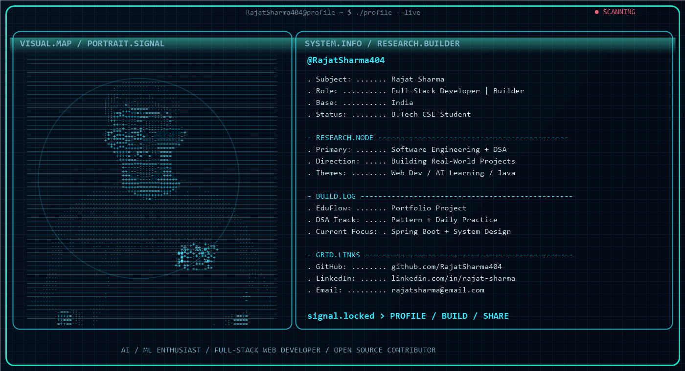

  <h1>Hey Everyone, I am Rajat Sharma 👋</h1>
  <h3>Computer Science Student | Full-Stack Software Engineer | Java & DSA Specialist | AI Enthusiast</h3>

  

    
    
    
    
  

  

    
  

  

---

## 👨‍💻 About Me & Engineering Focus

> *"Discipline beats motivation. Small, consistent progress every single day compounds into extraordinary results."*

- 🔭 **What I'm Building**: End-to-end full-stack platforms, developer productivity tools, and local **Agentic AI** ecosystems.
- 🧠 **Algorithmic Mastery**: Rigorous problem solver with structured DSA practice in **Java & C++**, emphasizing clean pattern-oriented approaches.
- ⚙️ **Core Tech Stack**: **TypeScript**, **React 19**, **Next.js 16**, **Node.js/Express**, **FastAPI**, **Spring Boot**, **WebAssembly**, and **MongoDB/MySQL/PostgreSQL**.
- 🤖 **AI & Autonomous Systems**: Implementing offline local agent workflows using **Ollama**, **FastAPI**, and modern AI reasoning techniques.
- 🤝 **Collaboration & Open Source**: Enthusiastic about collaborating on backend architectures, high-traffic web applications, and AI developer tooling.

---

## 🛠️ Technical Skills & Ecosystem

### 💻 Programming Languages

  
  
  
  
  
  
  
  

### 🎨 Frontend & UI Architecture

  
  
  
  

### ⚙️ Backend, Systems & APIs

  
  
  
  
  
  

### 🤖 AI, Machine Learning & Intelligent Agents

  
  
  
  
  

### 🗄️ Databases, Cloud & DevOps Tooling

  
  
  
  
  
  
  
  

---

## 🌟 Pinned Highlights

  
  

 

  
  

---

## 🚀 Featured Projects Catalog

| Category | Project | Description | Tech Stack |
| :--- | :--- | :--- | :--- |
| **AI Platforms** | [**Ghost AI**](https://github.com/RajatSharma404/ghost-ai) · [Live Demo](https://ghost-ai-omega-ten.vercel.app) | Modern AI-powered web platform with intelligent workflows and real-time generation tools. | Next.js 16, React, TypeScript, Tailwind CSS |
| **AI Platforms** | [**SkillSync**](https://github.com/RajatSharma404/SkillSync) | Personal performance scientist analyzing cross-domain metrics (coding, fitness, mood) for actionable insights. | TypeScript, React, Node.js, AI Workflows |
| **AI Platforms** | [**Agentic AI**](https://github.com/RajatSharma404/Agentic-AI) | Fully local Agentic AI web app executing autonomous multi-step reasoning with Ollama and FastAPI. | Python, FastAPI, Ollama |
| **Algorithms & Engines** | [**DSA Tracker Mastery**](https://github.com/RajatSharma404/DSA-Tracker) ⭐ | Competitive algorithmic tracking ecosystem (*"Project Ascend"*) to monitor problem-solving patterns. | TypeScript, React, Node.js, DSA Patterns |
| **Algorithms & Engines** | [**ChessEval**](https://github.com/RajatSharma404/Chess-Eval) | Advanced chess evaluation and position analysis platform powered by Stockfish 17 (WASM) and AI engine. | TypeScript, React, Stockfish 17 WASM |
| **Web Apps & Systems** | [**FitFlow (Fitness Roadmap)**](https://github.com/RajatSharma404/Fitness-Roadmap) | Evidence-based RPG fitness and progression platform with gamified habit & workout tracking. | Next.js 16, React 19, TypeScript |
| **Web Apps & Systems** | [**Interactive Portfolio**](https://github.com/RajatSharma404/Portfolio) · [Live Demo](https://portfolio-chi-self-31.vercel.app) | VS Code-inspired interactive developer portfolio featuring embedded terminal, AI Copilot, and motion UI. | TypeScript, React, Framer Motion |
| **Web Apps & Systems** | [**Finance Track**](https://github.com/RajatSharma404/Finance_track) · [Live Demo](https://finance-track-three.vercel.app) | Full-stack personal finance and expense tracking application with budget visualization and analytics. | React, Node.js, Express, MongoDB |
| **Hardware & Systems** | [**IoT MCU Programmer**](https://github.com/RajatSharma404/IoT-MCU-programmer) | Flask-based IoT device simulator with real-time hardware component emulation. | Python, Flask, IoT Simulation |

---

## 📊 GitHub Analytics & Performance Dashboard

  

 

  
  

  

  

---

## 📈 3D Contribution Matrix

  

---

## 📬 Let's Connect & Collaborate

  
  
  
  
  
  

  Designed with ❤️ by Rajat Sharma · Constantly evolving & shipping code.

