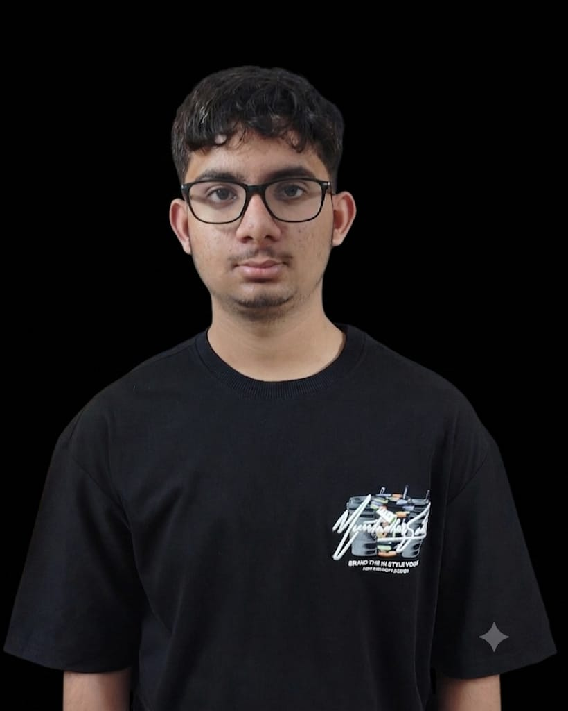

<h1 align="center">Rajat Sharma</h1>
<h3 align="center">Full-Stack Developer | DSA Enthusiast | Exploring AI</h3>

  

  

  B.Tech student focused on software engineering fundamentals, practical product building, and problem solving with data structures and algorithms.

---

## About Me

- Working on personal portfolio and coding practice projects
- Learning Spring Boot, backend architecture, and AI basics
- Interested in collaboration on Java and web development projects

---

## Tech Stack

  
  
  
  
  
  

---

## GitHub Analytics

  

  

  

---

## Contribution Snake

  

---

## Connect

  <a href="https://github.com/RajatSharma404">GitHub</a> |
  <a href="https://www.linkedin.com">LinkedIn</a> |
  <a href="mailto:rajatsharma@email.com">Email</a>

---

  

